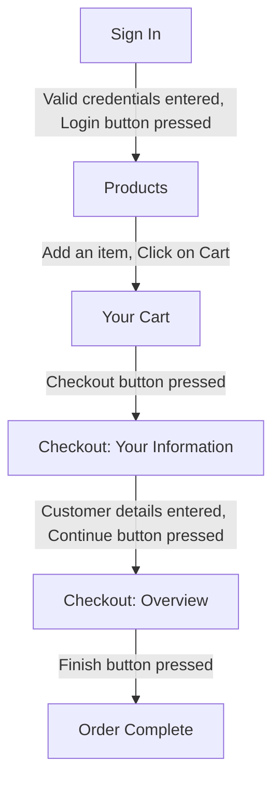

# Mini Automated Web Testing Project

## Project Description

Our framework uses NUnit, Selenium, and SpecFlow to test the functionality of the SauceDemo (https://www.saucedemo.com/) website.

The end-to-end user journey of buying a product from the site has been tested.

We have used NUnit, Selenium, SpecFlow as these are industry recognised tools that can be made use of by a wide community.

## How to Install & Run
### How to Install
1. Clone this repository
2. Open in Visual Studio 2022
3. Install or verify the installation of the following NuGet Packges:
- Microsoft.NET.Test.Sdk
- NUnit
- NUnit.Analyzers
- NUnit3TestAdapter
- Selenium.WebDriver
- Selenium.WebDriver.ChromeDriver
- Selenium.WebDriver.GeckoDriver
- SpecFlow
- SpecFlow.NUnit
- System.Configuration.ConfigurationManager

### How to Run

1. Open the solution in Visual Studio 2022
2. Open the Test Explorer view
3. Select "Run All" tests

## Project Contents

The project contains tests for the following primary user journey: From sign in to the successful purchase of a single item.

## How to Contribute
The team welcomes the submission of feature files with associated spec-flow step definitions containing tests for other user journies.